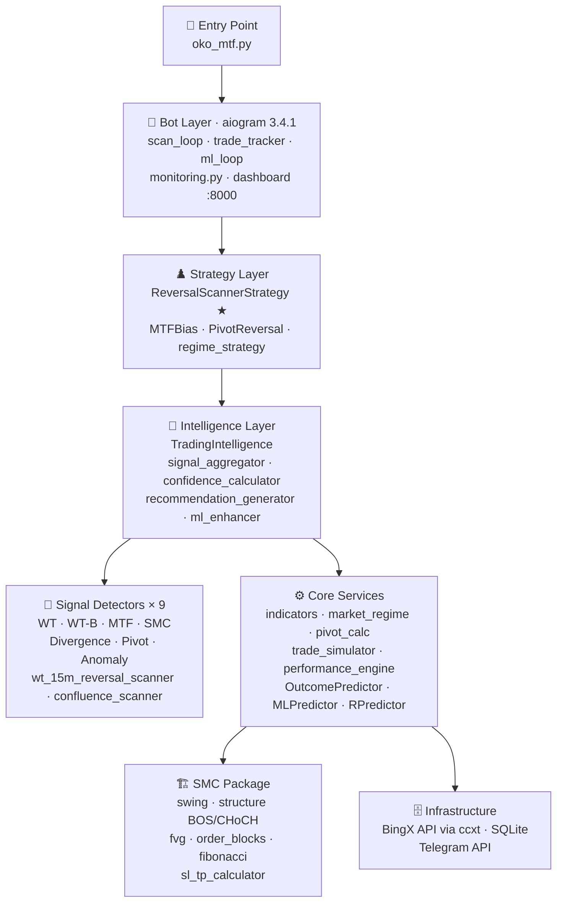
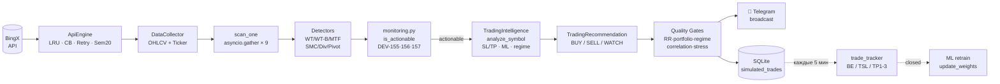
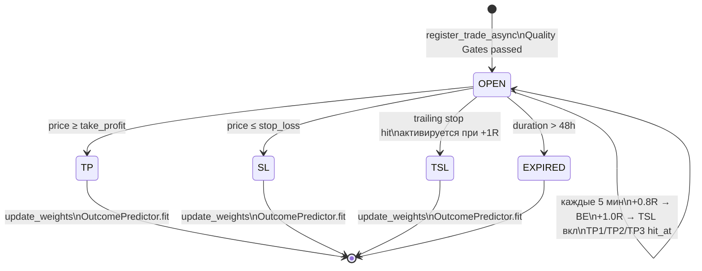
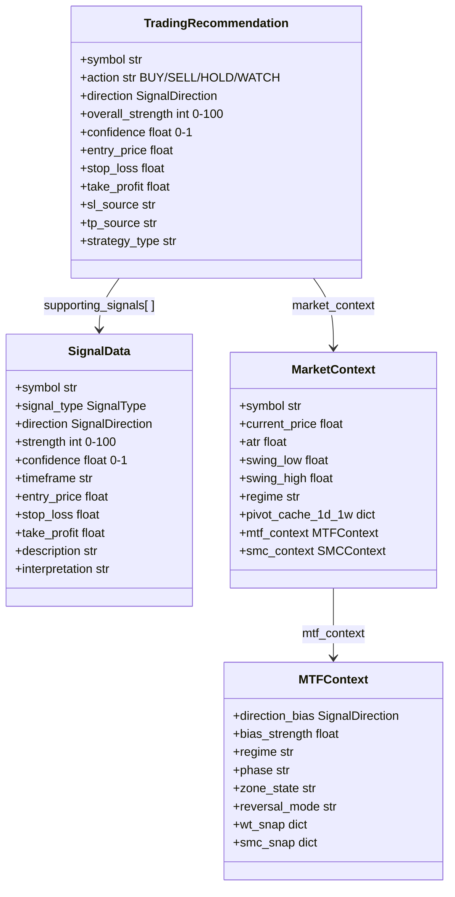

# Oko MTF Bot — Архитектурная карта

> Актуально на: 2026-04-12 | 427 пар в мониторинге | 3 200+ сделок в БД

---

## 0. Mermaid-диаграммы (интерактивный обзор)

> Рендерятся в VSCode (Mermaid Preview) и на GitHub автоматически.

### 0.1 Архитектурные слои



---

### 0.2 Путь сигнала: от биржи до Telegram



---

### 0.3 Жизненный цикл сделки



---

### 0.4 Ключевые data-классы



---

## 1. Высокоуровневая архитектура (5 слоёв)

```
┌─────────────────────────────────────────────────────────────────────────┐
│                        🚀 ENTRY POINT                                  │
│                   oko_mtf.py (~105 строк, +LLM hooks)                   │
│                   Только запуск → TradingAlertBot.run()                 │
└───────────────────────────────┬─────────────────────────────────────────┘
                                │
┌───────────────────────────────▼─────────────────────────────────────────┐
│                     🤖 BOT LAYER (aiogram 3.4.1)                       │
│                                                                         │
│  bot/core/bot.py ─── TradingAlertBot                                    │
│       │                                                                  │
│       ├── bot/loops/                                                     │
│       │    ├── scan_loop.py ──── scan_all_pairs() каждые 60 сек         │
│       │    ├── trade_tracker.py ── check_open_trades каждые 5 мин       │
│       │    └── ml_loop.py ──── train_all_models + weekly report         │
│       │                                                                  │
│       ├── bot/handlers/                                                  │
│       │    ├── /intelligence ── анализ символа                          │
│       │    ├── /scan ── топ-10 пар + watchlist                          │
│       │    ├── /pivots ── MTF пивоты 1M/1W/1D                           │
│       │    └── /settings ── персональный риск                           │
│       │                                                                  │
│       └── bot/monitoring.py ── фильтры + broadcast + BTC-regime         │
│                                                                         │
│  web/dashboard_server.py ── aiohttp :8000 (live trades, /settings)      │
└───────────────────────────────┬─────────────────────────────────────────┘
                                │
┌───────────────────────────────▼─────────────────────────────────────────┐
│                    ♟️ STRATEGY LAYER (ARCH-05)                          │
│                                                                         │
│  strategies/registry.py ── @register_strategy, get_strategy()           │
│       │                                                                  │
│       ├── ReversalScannerStrategy ★ АКТИВНАЯ                            │
│       │    └── 5 факторов: TSL cross + WT cross (обязат. гейты) +       │
│       │       pivot touch (0.15%) + WT zone + divergence                 │
│       │       8 баров lookback, без trend_1h/PP/dual_cross              │
│       │                                                                  │
│       ├── MTFBiasStrategy ── 7 TF alignment + senior gate               │
│       ├── PivotReversalStrategy ── S1/R1 + WT cross + FVG              │
│       ├── ConservativeStrategy ── min 3 сигнала                        │
│       └── ConfluenceStrategy ── базовый скоринг                        │
│                                                                         │
│  core/regime_strategy.py ── адаптация по режиму рынка                  │
│       TREND_UP/DOWN → TRIPLE_TP_TSL, sl_factor=0.85                    │
│       RANGE → DUAL_TP, sl_factor=1.15                                  │
│       HIGH_VOL → position_size×0.5, tp1_r=0.5                          │
└───────────────────────────────┬─────────────────────────────────────────┘
                                │
┌───────────────────────────────▼─────────────────────────────────────────┐
│                    🧠 INTELLIGENCE LAYER                                │
│                                                                         │
│  core/trading_intelligence.py (1061 строк — оркестратор)                │
│       │                                                                  │
│       ├── core/intelligence/                                            │
│       │    ├── signal_aggregator.py ── _analyze_signals_advanced()      │
│       │    │    └── adaptive_weighted_strength (веса из реальных сделок)│
│       │    │                                                             │
│       │    ├── confidence_calculator.py                                  │
│       │    │    └── signal_count_factor × zone × regime → confidence    │
│       │    │                                                             │
│       │    ├── recommendation_generator.py                              │
│       │    │    ├── _calculate_levels() — SL/TP иерархия:              │
│       │    │    │    swing_low/high → S1 pivot → FVG → TSL → ATR       │
│       │    │    ├── RR-фильтр ≥ 2.0                                    │
│       │    │    └── strategy_type: TRIPLE_TP_TSL / DUAL_TP / SINGLE    │
│       │    │                                                             │
│       │    └── ml_enhancer.py                                           │
│       │         ├── OutcomePredictor → P(win) → blend confidence       │
│       │         ├── MLPredictor → PRICE_DIRECTION, SIGNAL_STRENGTH     │
│       │         └── RPredictor → expected_R → Kelly sizing             │
│       │                                                                  │
│       └── Таймауты: HARD 20s (сигналы) / SOFT 15s (контекст) / ML 5s  │
│                                                                         │
│  ┌─────────────────────────────────────────────┐                       │
│  │         📡 SIGNAL DETECTORS (6+3)            │                       │
│  │                                              │                       │
│  │  core/signal_checkers.py:                    │                       │
│  │   ├ check_wt_signals ─── WT CrossUp/Down     │                       │
│  │   ├ check_wt_b_signals ── WT Type B ★WR=85% │                       │
│  │   ├ check_anomaly_signals ── volume spike    │                       │
│  │   ├ check_mtf_signals ── MTF alignment       │                       │
│  │   ├ check_smc_signals ── BOS/CHoCH           │                       │
│  │   ├ check_divergence_signals ── reg/hidden   │                       │
│  │   └ check_pivot_signals ── near S/R          │                       │
│  │                                              │                       │
│  │  core/wt_15m_reversal_scanner.py ── 5-factor  │                       │
│  │  core/confluence_scanner.py ── legacy (SM)   │                       │
│  │  core/divergence_detector.py ── cascade      │                       │
│  │  core/structure_detector.py ── SMC engine    │                       │
│  └─────────────────────────────────────────────┘                       │
└───────────────────────────────┬─────────────────────────────────────────┘
                                │
┌───────────────────────────────▼─────────────────────────────────────────┐
│                    ⚙️ CORE SERVICES                                     │
│                                                                         │
│  core/indicators.py ── WaveTrend, EMA, ADX, ATR, Swing H/L, TSL-line  │
│  core/market_regime.py ── ADX+ATR+EMA / MTF Bias+WT+ATR → 4 режима    │
│  core/pivot_calculator_fixed.py ── 1M/1W/1D UTC pivots + cache        │
│  core/trade_simulator.py ── register/track/close + MFE + partial TP   │
│  core/performance_engine.py ── stats, by_signal_type, weekly_summary   │
│                                                                         │
│  ML:                                                                    │
│  ├── core/outcome_predictor.py ── RandomForest P(win), CV AUC ~0.56   │
│  ├── core/ml_predictor.py ── GradientBoosting PRICE_DIRECTION          │
│  └── core/r_predictor.py ── GBR expected_R → Kelly fraction           │
│                                                                         │
│  core/smc/ ── Smart Money Concepts пакет (ARCH-17, 18-20.03.2026)      │
│       ├── swing_points.py ── HH/HL/LH/LL классификация                 │
│       ├── structure.py ── BOS/CHoCH + Breaker Blocks                    │
│       ├── fvg.py ── Fair Value Gap + mitigation                          │
│       ├── order_blocks.py ── OB (последняя свеча перед BOS)             │
│       ├── liquidity.py ── swept/unswept кластеры                        │
│       ├── fibonacci.py ── OTE зона (0.618-0.786)                        │
│       └── context.py ── SMCContext: агрегат всех SMC данных             │
│                                                                         │
│  core/data_collector.py ── OHLCV + ticker (делегирует в ApiEngine)     │
│  core/api_engine.py:                                                    │
│       ├── OhlcvCache ── LRU OrderedDict, maxsize=5000                  │
│       ├── CircuitBreaker ── 10 ошибок → OPEN 30s → HALF_OPEN          │
│       ├── In-flight dedup ── 1 API-вызов на N одинаковых запросов      │
│       ├── Retry × 3 ── exp backoff (Network 1/2/4s, RateLimit 5/10/20)│
│       └── Semaphore(20) ── единая точка контроля параллелизма          │
└───────────────────────────────┬─────────────────────────────────────────┘
                                │
┌───────────────────────────────▼─────────────────────────────────────────┐
│                    🏗️ INFRASTRUCTURE                                    │
│                                                                         │
│  BingX API (ccxt 4.2.85, enableRateLimit=False)                        │
│  SQLite: subscriptions.db                                               │
│       ├── simulated_trades (30+ полей, MFE, partial TP, regime)        │
│       ├── users + subscriptions (4 тира)                               │
│       ├── user_settings (deposit/leverage/risk)                        │
│       ├── watchlist (max 20 пар/user)                                  │
│       ├── confluence_states (State Machine persist)                     │
│       └── pivot_cache (in-memory + SQLite backup)                      │
│  Telegram API (aiogram 3.4.1)                                          │
└─────────────────────────────────────────────────────────────────────────┘
```

---

### 1.1 Хаб шины Куба вне процесса бота (ADR-003, с 30.09.2026)

```
 oko-bot (Sub-куб «торговый контур»)                 cube-hub (центр главного Куба)        другие процессы
 PairContextBus — синхронная, остаётся здесь  ──►   127.0.0.1:8020, oko_feed/cube.db  ◄──  GET /state, /facts,
   крючок publish/update → cube_mirror.py            доска: все поля пар (upsert)           /ws (поток фактов)
   грязные пары + круговой досыл, поток-отправщик    журнал фактов 30 дней
```

- Бот зеркалит шину (флаг `cube_hub.enabled`); хаб — реплика, ничего не считает, писатель базы один.
- Класс события (state / fact / internal) — `core/context/bus_catalog.EVENT_CLASS`.
- Шаги 2–5 (читатели → внешние производители → входящий мост → сферы наружу) — `docs/adr/ADR-003-bus-out-of-process.md`.

## 2. Поток данных: от биржи до Telegram

```
BingX Exchange
      │
      │ ccxt fetch_ohlcv (enableRateLimit=False)
      ▼
┌─────────────┐
│ ApiEngine   │─── LRU Cache (5000) ─── CircuitBreaker ─── Retry×3
│ Semaphore20 │─── In-flight dedup
└──────┬──────┘
       │
       ▼
┌─────────────┐
│ DataCollect  │─── get_ohlcv(symbol, tf, limit)
│             │─── get_ticker(symbol) → current price
└──────┬──────┘
       │ DataFrame (OHLCV)
       ▼
┌─────────────────────────────────────┐
│        scan_one(symbol)             │
│                                     │
│  prefetch: 15m + 1h + 3m, limit=160│
│                                     │
│  asyncio.gather:                    │
│   ├─ check_wt_signals(df_15m)       │
│   ├─ check_wt_b_signals(df_1h)     │ ← ★ WR=85%
│   ├─ check_anomaly_signals(df_15m)  │
│   ├─ check_mtf_signals(15m,1h,3m)  │
│   ├─ check_smc_signals(df_15m)     │
│   └─ detect_divergence(df_15m,160) │
│                                     │
│  Результат: List[SignalData]        │
└──────┬──────────────────────────────┘
       │ сигналы найдены?
       ▼
┌─────────────────────────────────────┐
│  _broadcast_intelligence_alert      │
│                                     │
│  Фильтры:                          │
│   ├─ dedup: 1 алерт/пару/30 мин   │
│   ├─ sl_cooldown: 4 часа после SL  │
│   └─ BTC regime: HIGH_VOL → block  │
│                                     │
│  analyze_symbol() ← _analyze_sem(3)│
└──────┬──────────────────────────────┘
       │
       ▼
┌─────────────────────────────────────┐
│    TradingIntelligence              │
│    analyze_symbol(symbol, dfs)      │
│                                     │
│  1. snapshot_time = now()           │
│  2. Strategy.analyze(context)       │
│  3. _analyze_signals_advanced       │
│     └─ adaptive_weighted_strength   │
│  4. calculate_advanced_confidence   │
│     └─ signal_count × zone × regime│
│  5. _calculate_levels (SL/TP)       │
│     └─ swing → pivot → FVG → TSL   │
│  6. enhance_analysis_with_ml        │
│     └─ P(win) blend + Kelly sizing  │
│  7. _generate_recommendation        │
│     └─ BUY/SELL/WATCH + risk_level  │
└──────┬──────────────────────────────┘
       │ TradingRecommendation
       ▼
┌─────────────────────────────────────┐
│  Фильтры actionable/register       │
│                                     │
│  is_actionable:                     │
│   strength ≥ 50                     │
│   action ∈ {BUY, SELL}              │
│   direction ≠ NEUTRAL               │
│        │                            │
│        ├─ YES → TG Alert            │
│        │        + register_trade    │
│        │                            │
│  should_register:                   │
│   strength ≥ 75 (min_strength_reg)  │
│        │                            │
│        ├─ YES → register only       │
│        └─ NO  → log INFO skip      │
└──────┬──────────────────────────────┘
       │
       ├──────────────────────┐
       ▼                      ▼
┌──────────────┐    ┌───────────────┐
│ Telegram     │    │ SQLite        │
│ broadcast    │    │ INSERT trade  │
│ to users     │    │ + MFE + regime│
└──────────────┘    └───────┬───────┘
                            │
                    каждые 5 мин
                            ▼
                   ┌────────────────┐
                   │ trade_tracker  │
                   │ check_open     │
                   │                │
                   │ BE при +0.8R   │
                   │ TSL при +1.0R  │
                   │ TP1/TP2/TP3    │
                   │ SL / EXPIRED   │
                   └────────┬───────┘
                            │
                            ▼
                   ┌────────────────┐
                   │ ML retrain     │
                   │ update_weights │
                   │ weekly_report  │
                   └────────────────┘
```

---

## 3. Жизненный цикл сделки

```
   Сигнал найден
        │
        ▼
   ┌─── Фильтры ──────────────┐
   │ dedup? cooldown? BTC?     │──── skip
   └─────────┬─────────────────┘
             │
             ▼
   ┌─── analyze_symbol ───────┐
   │ signals → strength →     │
   │ confidence → SL/TP → ML  │
   └─────────┬────────────────┘
             │
             ▼
   ┌─── actionable? ──────────┐
   │ str≥50 + BUY/SELL        │──── WATCH → skip
   └─────────┬────────────────┘
             │
             ▼
   ┌─── register_trade ───────┐
   │ regime classify           │
   │ apply_regime_to_strategy  │
   │ RR ≥ 2.0? → proceed     │
   │ strategy_type:            │
   │   RR≥3 → TRIPLE_TP_TSL   │
   │   RR∈[2,3) → DUAL_TP    │
   └─────────┬────────────────┘
             │
             ▼
        ┌─ OPEN ─┐
        │        │
        │  каждые 5 мин:
        │  check_open_trades
        │        │
        ├── MFE: max_price / min_price
        │        │
        ├── current_R ≥ 0.8 → безубыток (SL → entry ± 0.1%)
        │        │
        ├── tp1_hit_at → безусловный BE для MULTI_TP (DEV-57)
        │        │
        ├── current_R ≥ 1.0 → Cascade TSL активирован
        │   │  4h тренд совпадает → TSL по 4h (самый широкий)
        │   │  1h тренд совпадает → TSL по 1h
        │   │  иначе → TSL по 15m (тесный)
        │   │  fallback: если ни один TF не подошёл → prev_tsl_tf (DEV-67)
        │        │
        ├── TP1 hit → tp1_hit_at записан
        ├── TP2 hit → tp2_hit_at записан
        │        │
        ▼        ▼
   ┌─── Закрытие ─────────────────────────────┐
   │ TP: цена ≥ take_profit                    │
   │ SL: цена ≤ stop_loss                      │
   │ TSL: цена пробила trailing stop           │
   │ EXPIRED: > 48 часов                        │
   └───────────────────────────────────────────┘
        │
        ▼
   ML обучение: update_signal_weights()
   OutcomePredictor.fit() → новые P(win)
   Адаптивные веса: base × clamp(1 + avg_R × 0.4)
```

---

## 4. База данных (simulated_trades)

```
┌──────────────────────────────────────────────────────────────┐
│                     simulated_trades                         │
├──────────────────────────────────────────────────────────────┤
│ ИДЕНТИФИКАЦИЯ                                                │
│   id (PK), symbol, timeframe, signal_type, direction        │
│                                                              │
│ ЦЕНЫ                                                         │
│   entry_price, stop_loss, take_profit                        │
│   tp1_price, tp1_hit_at                                      │
│   tp2_price, tp2_hit_at                                      │
│   tp3_price, tp3_hit_at                                      │
│                                                              │
│ МЕТРИКИ СИГНАЛА                                              │
│   strength (0-100), confidence (0.0-1.0)                    │
│   regime (TREND_UP|TREND_DOWN|RANGE|HIGH_VOL)               │
│                                                              │
│ ЖИЗНЕННЫЙ ЦИКЛ                                              │
│   status (OPEN|TP|SL|TSL|EXPIRED)                           │
│   created_at, closed_at, duration_minutes                    │
│   exit_price, profit_pct, R_multiple                        │
│                                                              │
│ MFE (Maximum Favorable Excursion)                           │
│   max_price, min_price                                       │
│   max_R_possible, captured_R_pct                            │
│   first_profit_r, first_drawdown_r                          │
│                                                              │
│ МЕТАДАННЫЕ                                                   │
│   sl_source ("swing_low"|"atr_14"|"tsl_line"|"pivot_1W_S1")│
│   tp_source ("pivot_1W_R1"|"atr_multiple"|...)              │
│   strategy_type (TRIPLE_TP_TSL|DUAL_TP|SINGLE)              │
│   tsl_activated (0|1)                                        │
│   features_json {volume_24h, volatility, kelly_f, ...}      │
└──────────────────────────────────────────────────────────────┘

┌──────────────────┐  ┌──────────────────┐  ┌──────────────┐
│    users         │  │  subscriptions   │  │ user_settings│
│ user_id (PK)     │──│ user_id (FK)     │  │ user_id (PK) │
│ username         │  │ plan (free/pro)  │  │ deposit_usdt │
│ created_at       │  │ daily_limit      │  │ leverage     │
│ is_active        │  │ started_at       │  │ risk_pct     │
│ signals_today    │  │ expires_at       │  │ sl/tp_pct    │
└──────────────────┘  └──────────────────┘  └──────────────┘

┌──────────────────┐  ┌──────────────────┐  ┌──────────────┐
│   watchlist      │  │confluence_states │  │ pivot_cache  │
│ user_id (FK)     │  │ symbol (PK)      │  │ key (PK)     │
│ symbol           │  │ state (IDLE/...)  │  │ data (JSON)  │
│ added_at         │  │ updated_at       │  │ expires_at   │
└──────────────────┘  │ state_data (JSON)│  └──────────────┘
                      └──────────────────┘
```

---

## 5. Quality Gates в register_trade_async()

Каждая сделка проходит через цепочку guards перед записью в БД:

```
register_trade_async(recommendation)
    │
    ├── Market Stress Gate (DEV-48) — 5+ SL за 30 мин → block (shadow)
    │
    ├── Correlation Guard (DEV-38) — уже открыта из той же группы → block
    │    PAXG/XAUT, BTC/WBTC, ETH/STETH/WETH
    │
    ├── MarketRegimeClassifier.classify_from_ohlcv()  ← вычисляем режим здесь
    │
    ├── Regime Safety Gate (DEV-44/46)
    │    ├── regime in blocked_regimes [HIGH_VOL] → block
    │    └── regime_direction_block: TREND_DOWN+LONG → block, TREND_UP+SHORT → block
    │
    ├── Signal Regime Block (DEV-64B)
    │    └── явный список запрещённых пар (сигнал_тип + режим + направление)
    │
    ├── Portfolio Limit (DEV-52) — 2 LONG + 2 SHORT + 4 OPEN total → block
    │
    ├── max_rr cap (DEV-64A) — R:R > 3.0 → TP пересчитывается
    │
    └── register_trade(recommendation, regime=regime)
```

---

## 6. Веса сигналов и адаптация

```
Сигнал             Базовый вес    После адаптации    Роль
─────────────────────────────────────────────────────────────
MTF_BIAS              0.50           0.50             ★ tie-breaker
PIVOT_REVERSAL        0.20           0.24 (+20%)      ★ avg_R=+0.50
WT_B_SIGNAL           0.15           0.15             ★ WR=85% бэктест
CONFLUENCE            0.15           0.15             через стратегию
SMC_STRUCTURE         0.12           0.12             BOS/CHoCH
DIVERGENCE            0.10           0.10             фоновые задачи
WT_SIGNAL             0.08           0.133 (+66%)     avg_R=+0.83
TREND_SIGNAL          0.05           0.04 (-20%)      avg_R=-0.50
ANOMALY               0.03           0.03             только объём

Формула: new = base × clamp(1 + avg_R × 0.4, 0.5, 2.0)
Минимум 20 закрытых сделок для адаптации.
```

---

## 7. Семафоры и таймауты

```
Ресурс                  Лимит    Назначение
────────────────────────────────────────────
ApiEngine.Semaphore      20      все API-вызовы к бирже (api_rps=15)
scan_all_pairs           20      параллельный скан пар
_analyze_sem              3      analyze_symbol (тяжёлый)
check_mtf/trend/pivot    10      фоновые проверки
cascade_divergences       5      MTF-дивергенции
_prefetch_pivots          5      прогрев кеша

Таймаут                 Лимит    При превышении
────────────────────────────────────────────────
_collect_all_signals     20 сек   return None (hard block)
_get_market_context      15 сек   degraded mode + fallback
_enhance_analysis_ml      5 сек   рекомендация без ML
```
