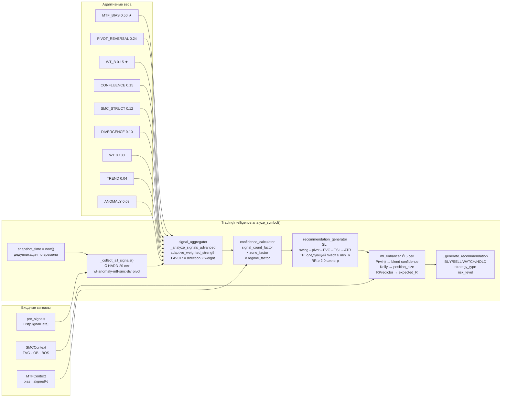
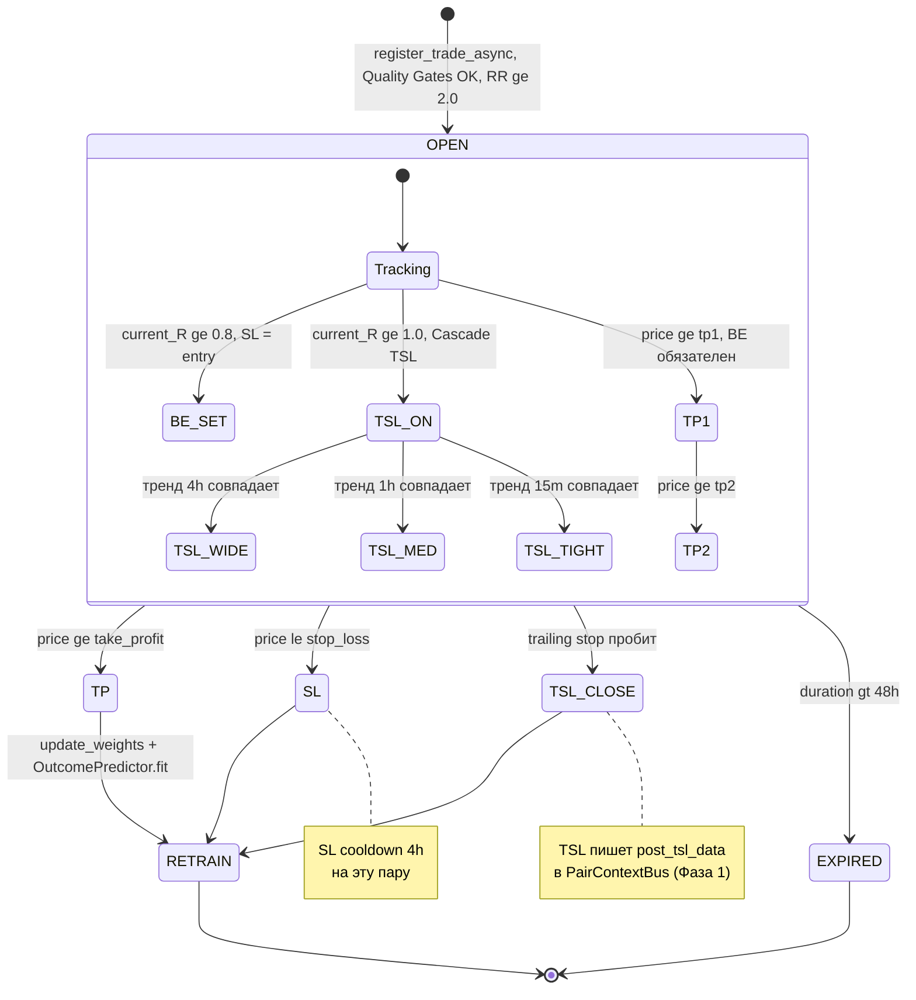
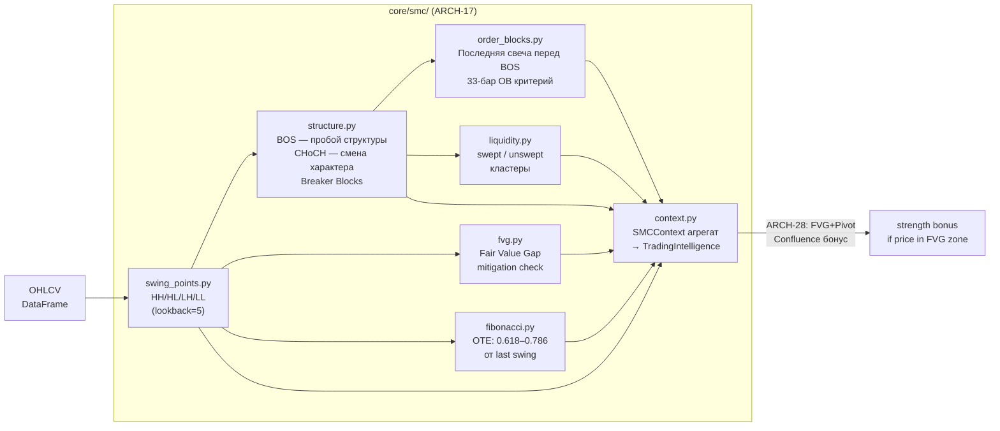
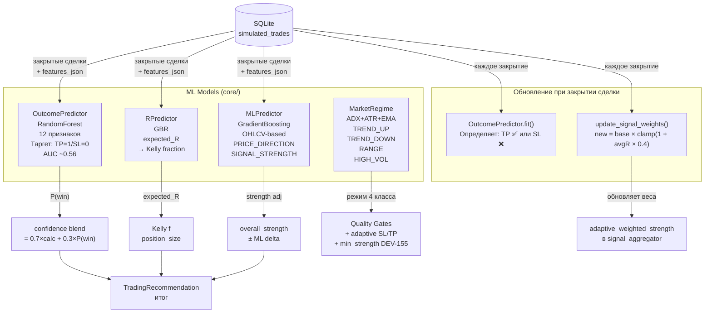
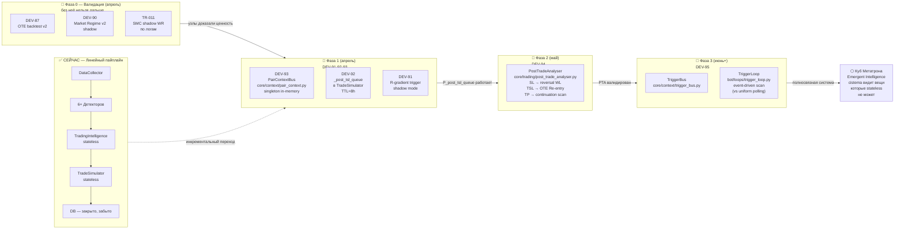
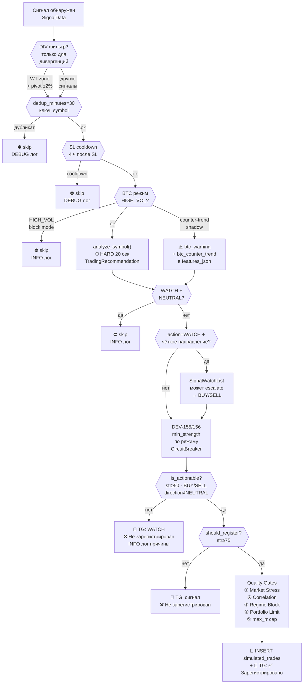

# Куб Метатрона — Полная архитектурная схема
> Oko MTF Bot · Актуально на 2026-04-18 · 427 пар · 3200+ сделок

---

## 1. Все сферы и рёбра — полносвязный граф

```mermaid
flowchart TD
    %% ════════════════════════════════════════
    %% ИНФРАСТРУКТУРА
    %% ════════════════════════════════════════
    subgraph INFRA["🌐 Инфраструктура"]
        EX["BingX<br/>ccxt 4.2.85"]
        AE["ApiEngine<br/>LRU·CB·Retry·Sem20"]
        DC["DataCollector<br/>OHLCV + Ticker"]
        DB[("SQLite<br/>subscriptions.db")]
    end

    %% ════════════════════════════════════════
    %% ДЕТЕКТОРЫ СИГНАЛОВ (9 типов)
    %% ════════════════════════════════════════
    subgraph DET["📡 Детекторы сигналов"]
        D1["WT Signal<br/>cross ±60"]
        D2["WT-B Signal<br/>★ WR=85%"]
        D3["MTF Signal<br/>7 TF alignment"]
        D4["Divergence<br/>reg/hidden cascade"]
        D5["Anomaly<br/>volume×3"]
        D6["Pivot Reversal<br/>S1/R1 + WT + FVG"]
        D7["Confluence<br/>ReversalScanner★"]
        D8["MTF Alert<br/>5 мин фоновый"]
        D9["Trend Signal<br/>4h+1h+15m+5m"]
    end

    %% ════════════════════════════════════════
    %% SMC СЛОЙ
    %% ════════════════════════════════════════
    subgraph SMC["🏗️ SMC Layer (core/smc/)"]
        SMC1["swing_points<br/>HH/HL/LH/LL"]
        SMC2["structure<br/>BOS / CHoCH"]
        SMC3["fvg<br/>Fair Value Gap"]
        SMC4["order_blocks<br/>OB последний"]
        SMC5["fibonacci<br/>OTE 0.618-0.786"]
        SMC6["liquidity<br/>swept/unswept"]
        SMCC["SMCContext<br/>агрегат"]
    end

    %% ════════════════════════════════════════
    %% ML СЛОЙ (3 модели)
    %% ════════════════════════════════════════
    subgraph ML["🤖 ML Layer"]
        ML1["OutcomePredictor<br/>RF P(win) AUC~0.56"]
        ML2["MLPredictor<br/>GB PRICE_DIR + STRENGTH"]
        ML3["RPredictor<br/>GBR expected_R → Kelly"]
        MR["MarketRegime<br/>ADX+ATR+EMA<br/>4 режима"]
    end

    %% ════════════════════════════════════════
    %% INTELLIGENCE LAYER
    %% ════════════════════════════════════════
    subgraph INT["🧠 Trading Intelligence"]
        IA["signal_aggregator<br/>adaptive_weighted_strength"]
        IB["confidence_calc<br/>signal×zone×regime"]
        IC["recommendation_gen<br/>SL/TP иерархия<br/>RR≥2.0 фильтр"]
        ID["ml_enhancer<br/>P(win) blend · Kelly"]
        TI["TradingIntelligence<br/>analyze_symbol<br/>⏱ HARD 20s · ML 5s"]
    end

    %% ════════════════════════════════════════
    %% СТРАТЕГИИ
    %% ════════════════════════════════════════
    subgraph STR["♟️ Стратегии"]
        S1["ReversalScanner ★<br/>TSL cross + WT cross<br/>+ pivot + div"]
        S2["PivotReversal<br/>S1/R1 + WT + FVG"]
        S3["MTFBias<br/>7 TF + senior gate"]
        S4["Conservative<br/>min 3 сигнала"]
        RS["regime_strategy<br/>TREND→TRIPLE_TP_TSL<br/>RANGE→DUAL_TP<br/>HIGH_VOL→×0.5"]
    end

    %% ════════════════════════════════════════
    %% ФИЛЬТРЫ (monitoring.py)
    %% ════════════════════════════════════════
    subgraph FILT["🔒 Фильтры (monitoring.py)"]
        F1["dedup<br/>30 мин / пара"]
        F2["SL cooldown<br/>4 ч после SL"]
        F3["BTC regime<br/>HIGH_VOL block"]
        F4["WATCH+NEUTRAL<br/>skip"]
        F5["is_actionable<br/>str≥50 · BUY/SELL"]
        F6["DEV-155/156<br/>min_str по режиму<br/>CircuitBreaker"]
    end

    %% ════════════════════════════════════════
    %% QUALITY GATES
    %% ════════════════════════════════════════
    subgraph QG["🛡️ Quality Gates (register_trade_async)"]
        G1["Market Stress<br/>5+ SL за 30 мин"]
        G2["Correlation Guard<br/>BTC/WBTC · PAXG/XAUT"]
        G3["Regime Block<br/>LONG в TREND_DOWN"]
        G4["Portfolio Limit<br/>2L+2S+4 total"]
        G5["max_rr cap<br/>RR>3 → обрезать"]
    end

    %% ════════════════════════════════════════
    %% СИМУЛЯТОР СДЕЛОК
    %% ════════════════════════════════════════
    subgraph SIM["💾 Trade Simulator"]
        TS["TradeSimulator<br/>register · track · close"]
        TT["TradeTracker<br/>⏱ каждые 5 мин"]
        MFE["MFE Tracker<br/>max/min price<br/>max_R · captured_R%"]
        TSL_NODE["Cascade TSL<br/>15m→1h→4h<br/>активация +1R"]
        BE["Breakeven<br/>+0.8R → SL=entry"]
    end

    %% ════════════════════════════════════════
    %% PERFORMANCE + ОБУЧЕНИЕ
    %% ════════════════════════════════════════
    subgraph PERF["📊 Performance + ML Retrain"]
        PE["PerformanceEngine<br/>stats · by_signal_type<br/>weekly_summary"]
        WU["update_weights<br/>base × clamp(1+avgR×0.4)"]
        FIT["OutcomePredictor.fit<br/>каждое закрытие"]
    end

    %% ════════════════════════════════════════
    %% BOT / UI
    %% ════════════════════════════════════════
    subgraph BOT["🤖 Bot / UI (aiogram 3.4.1)"]
        TG["Telegram<br/>broadcast"]
        CMD["/intelligence · /scan<br/>/pivots · /settings"]
        WL["SignalWatchList<br/>WATCH → escalate"]
        DASH["Dashboard :8000<br/>aiohttp (read-only)"]
    end

    %% ════════════════════════════════════════
    %% БУДУЩИЕ УЗЛЫ (Фазы 1-3)
    %% ════════════════════════════════════════
    subgraph FUTURE["🔮 Фаза 1-3 (Реактивный граф)"]
        PCB["PairContextBus<br/>Фаза 1 · DEV-93<br/>regime · cascade_count<br/>post_tsl_data"]
        PTA["PostTradeAnalyser<br/>Фаза 2 · DEV-94<br/>SL→reversal WL<br/>TSL→OTE queue"]
        TB["TriggerBus<br/>Фаза 3 · DEV-95<br/>event-driven scan"]
    end

    %% ════════════════════════════════════════
    %% РЁБРА — ПОТОК ДАННЫХ
    %% ════════════════════════════════════════

    EX -->|"ccxt fetch_ohlcv"| AE
    AE -->|"OHLCV DataFrame"| DC
    DC -->|"prefetch 15m+1h+3m"| D1 & D2 & D3 & D4 & D5 & D6 & D7
    DC -->|"фоновые / 5 мин"| D8 & D9

    %% SMC внутренние связи
    DC --> SMC1
    SMC1 --> SMC2
    SMC2 --> SMC3
    SMC3 --> SMC4
    SMC4 --> SMC5
    SMC5 --> SMC6
    SMC1 & SMC2 & SMC3 & SMC4 & SMC5 & SMC6 --> SMCC

    %% Детекторы → Фильтры
    D1 & D2 & D3 & D4 & D5 & D6 & D7 & D8 & D9 -->|"SignalData[]"| F1
    F1 --> F2 --> F3 --> F4

    %% SMC → Intelligence
    SMCC -->|"SMCContext"| TI

    %% Intelligence внутренние связи
    F4 -->|"pre_signals"| TI
    TI --> IA --> IB --> IC --> ID

    %% Стратегии → Intelligence
    S1 & S2 & S3 & S4 --> TI
    RS -->|"адаптация SL/TP"| IC

    %% ML ↔ Intelligence (двунаправленно)
    ML1 & ML2 & ML3 -->|"P(win) · Kelly · strength"| ID
    MR -->|"TREND/RANGE/HIGH_VOL"| TI
    MR -->|"режим"| RS

    %% Intelligence → Фильтры actionable
    TI -->|"TradingRecommendation"| F5
    F5 --> F6

    %% Фильтры → Quality Gates → Симулятор
    F6 -->|"should_register"| G1 --> G2 --> G3 --> G4 --> G5
    G5 --> TS

    %% Фильтры → TG (сообщение всегда)
    F6 -->|"broadcast"| TG

    %% Симулятор → DB
    TS -->|"INSERT simulated_trades"| DB
    DB -->|"SELECT OPEN"| TT

    %% Трекер внутри
    TT --> MFE
    TT --> BE
    TT --> TSL_NODE
    TSL_NODE -->|"Cascade 15m→1h→4h"| DC

    %% Закрытие → DB
    TT -->|"UPDATE status=TP/SL/TSL/EXPIRED"| DB

    %% DB → Performance + ML обратная связь
    DB -->|"закрытые сделки"| PE
    DB -->|"каждое закрытие"| FIT & WU
    FIT -->|"новые P(win)"| ML1
    WU -->|"новые веса"| IA
    ML2 & ML3 -->|"retrain ← features_json"| DB

    %% Bot UI
    CMD -->|"manual analyze_symbol"| TI
    DB -->|"read stats"| DASH
    DB -->|"read trades"| CMD
    WL -->|"WATCH→escalate"| F5

    %% Будущие рёбра (пунктир = планируемые)
    TS -.->|"Фаза 1"| PCB
    TT -.->|"post_tsl"| PCB
    PCB -.->|"Фаза 2"| PTA
    PTA -.->|"reversal WL"| WL
    PTA -.->|"OTE queue"| TI
    PCB -.->|"Фаза 3"| TB
    TB -.->|"event trigger"| TI
```

---

## 2. Внутренности Intelligence Layer — детальная схема

---

## 3. Жизненный цикл сделки — конечный автомат

---

## 4. Детекторы — типы и параметры

```mermaid
flowchart TD
    subgraph SCAN_LOOP["scan_one() — каждые 60 сек · Sem(20)"]
        D_WT["WT Signal<br/>wt1 cross wt2<br/>±60 zone · gap≥3<br/>str=70 · conf=0.8"]
        D_WTB["WT-B Signal ★<br/>1h · adaptive p10/p90<br/>div_strength 3-20<br/>str=70-90 · WR=85%"]
        D_MTF["MTF Signal<br/>1h trend + 15m WT<br/>+ 3m OB/OS<br/>str=85 · conf=0.9"]
        D_DIV["Divergence<br/>reg_bull/bear · hidden<br/>cascade 1h→15m<br/>bonус иерархии +25"]
        D_ANO["Anomaly<br/>volume > 3× MA20<br/>str=min(vol×10,100)"]
        D_CONF["Confluence ★<br/>ReversalScanner<br/>TSL cross + WT cross<br/>+ pivot 0.15% + div"]
    end

    subgraph BG_5MIN["Фоновые задачи — каждые 5 мин · Sem(10)"]
        D_MTF_A["MTF Alert<br/>7 TF alignment<br/>Classic/Aggr/Cons"]
        D_TREND["Trend Signal<br/>4h+1h+15m+5m<br/>Классик/Агрессив/Конс"]
        D_PIV["Pivot Reversal<br/>S1/R1 ±0.5% + WT<br/>+ FVG бонус +10"]
    end

    subgraph BG_1H["Фоновые — каждый час"]
        D_CASCADE["Cascade Divergence<br/>4h→1h hidden+regular<br/>бонус +15"]
    end

    D_WT & D_WTB & D_MTF & D_DIV & D_ANO & D_CONF --> FILT_OUT["→ Фильтры monitoring.py"]
    D_MTF_A & D_TREND & D_PIV --> FILT_OUT
    D_CASCADE --> FILT_OUT
```

---

## 5. SMC Layer — внутренности

---

## 6. ML Layer — обратная связь

---

## 7. Фазы перехода к Куб-архитектуре

---

## 8. Цепочка фильтров — от детектора до Telegram

---

## Примечания к схемам

| Обозначение | Смысл |
|---|---|
| ★ | Ключевой компонент с высоким WR |
| ⏱ | Операция с таймаутом |
| `→` | Прямой поток данных |
| `-.->` | Планируемая связь (Фазы 1-3) |
| DEV-NNN | Номер задачи в TASKS.md |
| ARCH-NN | Архитектурное решение |

**Философия «Куб Метатрона»:**
> Каждая из 13 точек соединена с каждой другой. Нет привилегированных путей, нет слепых зон.
> Система «знает» вещи которые ни один индикатор не может вычислить сам по себе.
> *Но: полносвязная система с непроверенными узлами = leverage на ошибки. Фундамент — сначала.*
