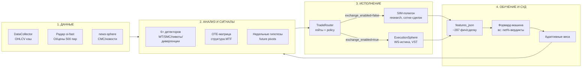
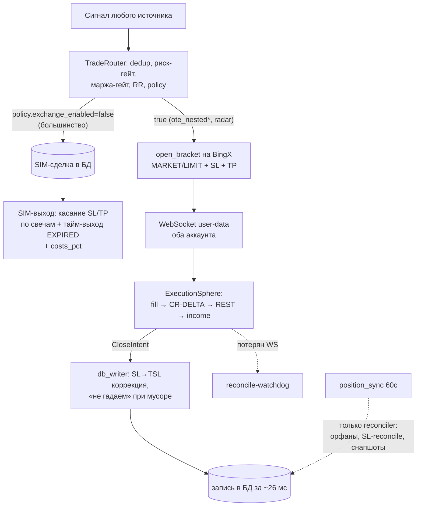

# Карта системы Oko MTF — как всё устроено

> Единая точка входа в проект. Каждая подсистема: что делает → зачем → где живёт.
> Термины: [GLOSSARY.md](GLOSSARY.md). Концепция: [ENCYCLOPEDIA.md](ENCYCLOPEDIA.md) («Куб Метатрона»).
> Обновлено: 13.07.2026 (день CUTOVER — раскола симуляции и биржи).

---

## Общая картина за 60 секунд

Oko MTF — **самообучающаяся торгово-аналитическая система** для крипторынка (BingX, ~500 перпетуалов).
Философия: *decision-support прежде автоторговли* — система строит понимание рынка, честно
меряет каждую свою идею живым форвардом в чистых процентах, и только доказанное допускает к деньгам.

Замкнутый цикл: **данные → сигнал → сделка (SIM или биржа) → честный результат → обучение → сигнал**.

---

## Слой 1 — Данные

| Компонент | Что делает | Где |
|---|---|---|
| **DataCollector** | OHLCV всех ТФ через ccxt/BingX, WS-кэш, force-refresh анти-stale | `core/infra/` |
| **Binance-кэш истории** | 472 символа, 15m/1h/4h с 2022 — для бэктестов (BingX даёт только ~7 мес) | `ohlcv_cache.db`, `scripts/fetch_binance_vision.py` |
| **Радар oi-fast** | Open Interest + цены ~500 перпов раз в минуту; окно 15 мин в памяти | `scripts/oi_fast_poller.py` (pm2 `oi-fast`) |
| **radar_state** | Живой контекст радара (ΔOI, funding, квадрант, hot-флаг) → мост в фичи сделок | таблица + `oko_feed/bridge.py` |
| **news-sphere / tg-collector** | Новости, CMC (USDT.D, Fear&Greed), Telegram-каналы | `scripts/news_sphere.py`, `tg_collector.py` |
| **Автобэкап** | Критичные БД ежедневно 04:10 на другой физический диск | `scripts/backup_dbs.py` (pm2 cron) |

**БД:** `subscriptions.db` (SQLite) — ядро: `simulated_trades` (все сделки SIM+VST, статусы
OPEN/TP/SL/TSL/EXPIRED), `radar_state`, `pivot_cache`, `weekly_pivot_*`, `weekly_hypothesis`,
`balance_snapshots`, `liq_events` и др.

---

## Слой 2 — Анализ и сигналы

### Постоянные детекторы (SIM-полигон, скан-луп)
`atr_change`, `wt_sideways`, `wt_signal`, `divergence`, `pivot_reversal`, `confluence`,
`arch104` (187 паттернов), `liquidity_sweep`, `watch_list_breach`… — все пишут сделки в полигон.
Карта сигналов: [BOT_SIGNAL_MAP.md](../BOT_SIGNAL_MAP.md).

### Структурный анализ (SMC)
- **OTE-матрица** — структура MTF по правилам владельца: слом = последний экстремум перед
  обновлением, вложенность ТФ (младший внутри старшего), OTE-зоны от ног импульса.
  `core/smc/ote_matrix.py`
- **ote_nested** — mean-reversion вход на откате в OTE-зону. Живёт в полигоне
  (+0.52%/сд честными), на биржу закрыт до починки входа. `bot/loops/ote_observer_loop.py`
- **method_egor** — формализация ручного метода: сторона от структуры → CHoCH len5 триггер →
  лимитка на откате. `core/smc/method_egor.py`, `bot/loops/method_egor_loop.py`

### Импульсный контур (радар)
- **BUILD** (набор OI) — направление из структуры 1h + **конкорданс-гейт** (не входить против
  15-мин потока OI×цена);
- **PUMP** (разворот пампа) — исторически прибыльный (+3.4%);
- **SPRING** (пружина до движения), **сквизы**, магниты ликвидаций (`liq_magnets`), карта целей 2.0.
- Вход двухфазный **ARMED→FIRE**, ведение: частичный TP → BE → структурный хвост-раннер.
  `bot/loops/radar_armed_loop.py`

### Проактивный слой (13.07)
- **weekly_pivot_watch** — зона открытия недели + лог касаний S1/S2/R1/R2 (pm2, */15м);
- **weekly_hypothesis** — план недели заранее: режим (наклон P) + зона открытия → гипотеза
  с целью/инвалидацией из измеренной карты поведения; скоринг по касаниям.
  `scripts/weekly_pivot_watch.py`, `weekly_hypothesis.py`

---

## Слой 3 — Исполнение (после Раскола 13.07)

Ключевое после CUTOVER: **симуляция и биржа не пересекаются в выходах.**
SIM-сделки доигрывает симулятор (честное касание + издержки), биржевые закрывает Сфера из
WS-истины. Старый путь «закрытие по цене» выключен (мгновенный откат флагом).

| Механизм | Статус | Где |
|---|---|---|
| CUTOVER (Сфера авторитетна) | ✅ в бою 13.07 16:04 | `config: trading.exec_ws.sphere_cutover` |
| CR-DELTA (гонка pa=0) | ✅ в бою, точность 0.05-0.08% | `core/execution/sphere.py` |
| SL→TSL коррекция | ✅ | `core/execution/db_writer.py` |
| Partial-защита (TP1 ≠ exit) | ✅ | `core/execution/position_store.py` |
| Защита от глюков BingX (cr="", pa×10) | ✅ | adapter + store |
| VST-time-exit | 🟡 shadow (алерты) | `core/exchange/position_sync.py` |
| Риск/маржа гейты (DEV-52) | ✅ активны | `trade_simulator.py` |
| Мультиаккаунт (acc1/acc2, hedge) | ✅ | `core/exchange/` |

---

## Слой 4 — Обучение и суд

| Компонент | Что делает |
|---|---|
| **features_json** | ~287 разреженных фич на сделку (структура, зоны, дивергенции, квадрант, фазы радара, каскады). Принцип: фичи пишутся, не фильтруют |
| **Форвард-машина** | Каждое вс 08:00 — net%-вердикт по каждому источнику: кормит/льёт/наблюдать. REAL-MONEY гейт |
| **Адаптивные веса** | `new_weight = base × clamp(1 + avg_R×0.4, 0.5, 2.0)`, порог 20 сделок |
| **deadflag-audit** | Еженедельный поиск «мёртвых» фич (всегда 0/1 — сломанный расчёт) |
| **pivot-sanity** | Ежедневная сверка пивотов с биржей (класс ARB-бага: протухший кэш) |

**Главные законы измерения:**
1. Только **net%** (gross − издержки), не R — R обманывает.
2. Только **реальный филл** (`actual_entry_price`), не сигнальная цена.
3. **Data-era**: честная эра с 11.07.2026 (touch+costs) — через границу не сравнивать.
4. Look-ahead — три класса ловушек задокументированы, стандарт: intrabar-имитация HTF.

---

## Слой 5 — Интерфейсы

| Интерфейс | Что даёт |
|---|---|
| **Telegram-бот** (aiogram) | Меню, `/intelligence`, паспорт монеты (тикер → карта Куба + SMC-чарт), команда «радар», алерты (action/feed/system каналы) |
| **Дашборд :8000** (aiohttp) | Оперативка из шины, sync-панель, настройки hot-reload |
| **OKO Dashboard :3000** (Next.js) | v2: сделки, статистика, OTE-мониторинг (pm2 `oko-dash`) |
| **Obsidian vault** | ~650 заметок: задачи, обсуждения, концепты — граф знаний проекта |

---

## Процессы (pm2)

| Процесс | Роль | Режим |
|---|---|---|
| `oko-bot` | ядро: скан, детекторы, TG, исполнение | постоянный |
| `oi-fast` | радар OI | постоянный |
| `oko-dash` | Next.js дашборд | постоянный |
| `news-sphere`, `tg-collector`, `usdtd-watch` | контекст рынка | постоянные |
| `weekly-pivot` / `weekly-hypo` | вотчер пивотов / гипотезы | cron */15м / час |
| `pivot-sanity` | сверка пивотов | cron 00:25 |
| `backup-dbs` | бэкапы на F: | cron 04:10 |
| `forward-machine` | судья источников | cron вс 08:00 |
| `deadflag-audit` | аудит фич | cron вс 06:30 |
| `accum-scan` | сканер накоплений | cron 07:40 |

⚠️ pm2 cron — в **локальном времени** (UTC+3).

---

## Куда смотреть дальше

| Вопрос | Документ |
|---|---|
| Термин непонятен | [GLOSSARY.md](GLOSSARY.md) |
| Философия и Куб Метатрона | [ENCYCLOPEDIA.md](ENCYCLOPEDIA.md) |
| Как течёт сигнал | [BOT_SIGNAL_MAP.md](../BOT_SIGNAL_MAP.md) |
| Дизайн слоя исполнения | [EXECUTION_SPHERE_DESIGN.md](EXECUTION_SPHERE_DESIGN.md) |
| Схема БД v2 | [DB_ARCHITECTURE_V2.md](DB_ARCHITECTURE_V2.md) |
| План радара | [RADAR_ARMED_PLAN.md](RADAR_ARMED_PLAN.md) |
| Метод владельца (OTE вход v2) | [OTE_METHOD_ENTRY_V2.md](OTE_METHOD_ENTRY_V2.md) |
| Этапы проекта | [../ROADMAP.md](../ROADMAP.md) |
| Что происходит прямо сейчас | `memory/current_state.md`, `whats-next.md`, `TASKS.md` |

> Остальные ~70 файлов в `docs/` — рабочие материалы эпиков и аудитов (история решений).
> Начинать чтение проекта следует с этой карты, глоссария и энциклопедии.
